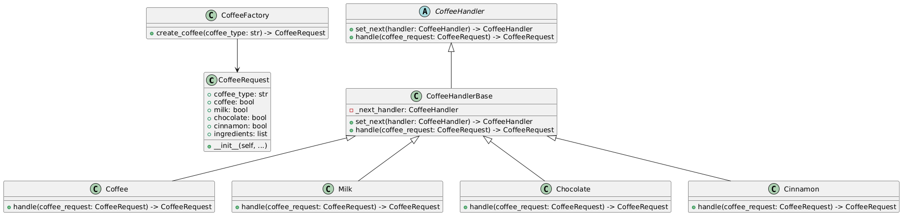
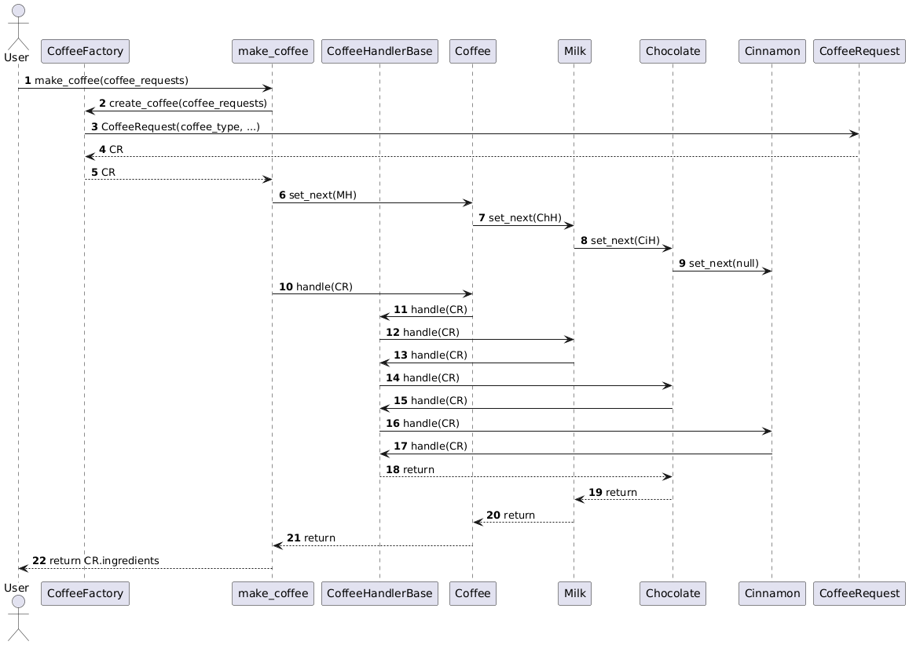

# Mismo Café, Otro Código  

La cafetería sigue entregando los mismos productos que antes, pero algo cambió detrás del mostrador: ¡nuestro código! 🎉  

## El Menú  

- **Café simple**  
- **Café con leche**  
- **Mocha**  
- **Leche sola**  
- **Café con canela**  

Nada nuevo bajo el sol, pero en el *backend* ahora tenemos un sistema que promete ahorrarnos un montón de dolores de cabeza a medida que crecemos.  

---

## El Código  

Decidimos darle un giro al núcleo del sistema:  
- Si un cliente pide algo que no tenemos, se lo decimos con una sonrisa (y quizás anotamos el pedido para futuras versiones).  
- Mostramos los pasos de preparación, por ejemplo: *“Agregando café”*, *“Agregando leche”*, etc.  
- Devolvemos el resultado final del pedido, como *“cafe" "leche" "chocolate"*.  

Pero, como los `if` estaban comenzando a parecer un Jenga, optamos por implementar el patrón de diseño **Cadena de Responsabilidad**.  

---

## La Solución: Cadena de Responsabilidad  

### Los Componentes  

1. **`CoffeeRequest`:**  
   - Representa lo que el cliente pide y mantiene el estado del pedido.  
   - Por ejemplo, si ya se agregó café, leche o canela.  

2. **`Handler`:**  
   - Una clase base que define cada paso del proceso de preparación.  
   - Ejemplos: `CoffeeHandler` para agregar café, `MilkHandler` para agregar leche.  
   - Si el handler no puede manejar el pedido, lo pasa al siguiente en la cadena.  

3. **Fábrica (`Factory`):**  
   - Ayuda a construir solicitudes iniciales sin mucho esfuerzo.  

---

### Ejemplo: Preparar un Mocha  

Dado la cadena que tenemos, el flujo de preparación se ve así:  
1. El `CoffeeHandler` agrega café.  
2. El `MilkHandler` agrega leche.  
3. El `ChocolateHandler` agrega chocolate.  
4. El `CinnamonHandler` pasa el pedido al siguiente (porque un Mocha no lleva canela).  
5. Al final, el sistema devuelve el pedido completo al cliente.  

---

### Importancia de los Archivos  

Aunque modularizamos el código, por ahora todo está en un solo archivo (`main.py`) para facilitar la comparación entre el antes y el después. En proyectos reales, la división en múltiples archivos sería crucial, pero aquí buscamos claridad antes que perfección.  

---

### Diagrama de Clases  

Así queda nuestra estructura:  

  

---

### Diagrama de Secuencia  

Y este es el flujo para preparar un café:  

  

---

## Conclusión  

Con este nuevo enfoque:  

- **Escalabilidad:** Podemos añadir nuevos ingredientes o tipos de café sin tocar demasiado el código existente, cumplimos con el principio del Open-Close.  
- **Claridad:** Cada `Handler` tiene una sola responsabilidad, cumpliendo con el principio de responsabilidad única (SRP).  
- **Flexibilidad:** Los cambios son más fáciles y menos propensos a romper el código.  
- Aunque el código parece más complejo ahora, crea una base sólida para futuras expansiones.  

---

## 🚀 Próximo Paso  

Es posible que alguien diga: *“Esto parece más complicado, pero no mejora mucho”*. Y tienen razón... por ahora. Pero en el siguiente episodio, veremos cómo esta estructura brilla cuando añadimos complejidades como endulzar nuestro café.  

¡Nos vemos en el próximo capítulo! Descubre más en [005-ampliando-la-cafeteria](../005-ampliando-la-cafeteria).  
