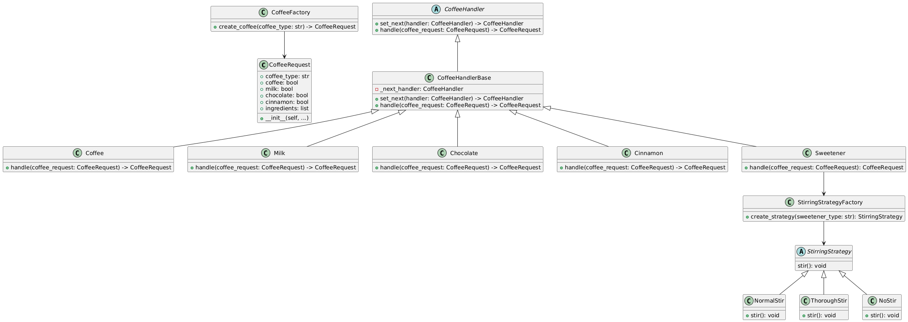
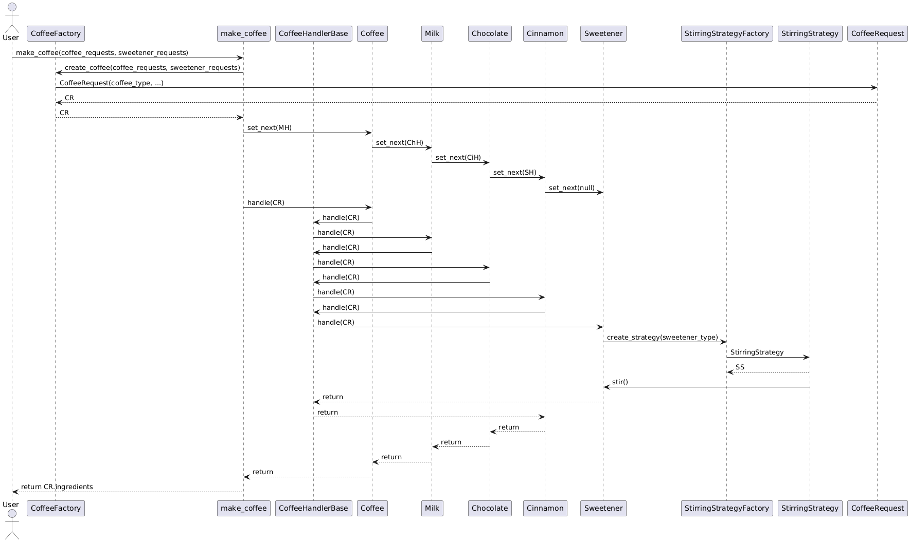

# Ampliando la Cafetería

## El Código

### Diagrama de Clases

Así es como luce la estructura de nuestro código:

### Diagrama de Secuencia

Y aquí está cómo interactúan las diferentes piezas cuando preparamos un café:

## Conclusión

