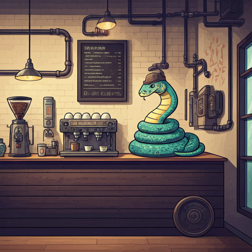

# No Cadena de Responsabilidad

> **NOTA:** Puse el "NO" adelante para espantar a los puristas. No queremos que arruinen la diversión de aprender con ejemplos, ¿verdad?

---

¡Bienvenido/a! Aquí vamos a explorar el fascinante mundo de los patrones de diseño, específicamente el patrón de **Cadena de Responsabilidad**. ¿La idea? Ir construyendo un ejemplo práctico, entendiendo cómo este patrón puede transformar nuestro código y, de paso, descubrir cómo otros patrones pueden complementarlo para crear un software más mantenible.

---

## Escenario

Vamos a modelar una **cafetería** en Python. No, el código no te preparará un espresso (aunque sería genial). Más bien, nos centraremos en construir el dominio de la cafetería, esquematizándolo a medida que avanzamos.  

La premisa es simple: empezaremos con un código básico y veremos cómo los patrones de diseño nos ayudan a escalarlo sin que el café se enfríe. 

---

### Comentarios para Mantenernos Felices

Algunas cosas importantes antes de comenzar:

- **Es un ejemplo de juguete:** Esto es intencional. Queremos que te concentres en las ideas detrás de los patrones, no en los detalles minuciosos. Sí, básicamente vamos a matar un mosquito con una bazuca, ¡pero es por una buena causa!
  
- **Libertades creativas:** No seguimos los libros al pie de la letra, porque, seamos honestos, ¡eso sería aburrido! La idea es aprender, encontrar fallas y sugerir mejoras. Y si los libros son lo tuyo, siempre estarán ahí esperándote.

---

## ¿Dónde comenzar?

Dirígete a la carpeta [001-una-nueva-cafeteria](./001-una-nueva-cafeteria) y sigue el viaje explorando los demás ejemplos. 

Cada carpeta te llevará un paso más allá en la implementación de patrones y en el entendimiento de cómo se entrelazan para crear un código más robusto.

---

**Disfruta del viaje tanto como yo disfruté creándolo!**  
*(Esta bien, ChatGPT, Gemini y un poquito de Copilot ayudaron, pero tú también puedes tener asistentes, ¿no?)*

